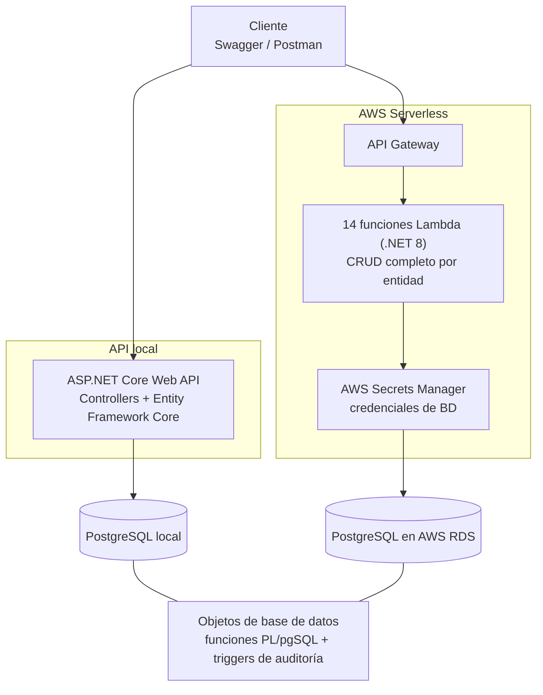
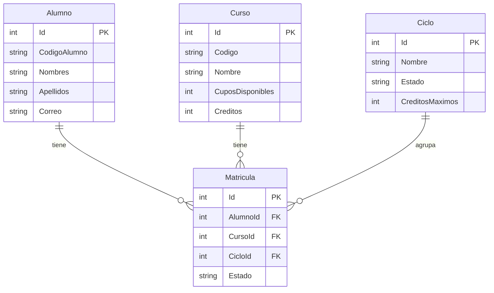

# Sistema de Matrículas Universitarias

Sistema backend de gestión académica que simula el proceso de matrícula de una institución educativa. Implementado en dos variantes que comparten el mismo modelo de datos: una **API REST tradicional** (ASP.NET Core) y un **conjunto de funciones serverless** desplegadas en AWS Lambda.

El proyecto fue construido como práctica dirigida a un puesto de **Analista Programador Backend** con stack AWS Serverless, C#/.NET Core y PostgreSQL, cubriendo de forma explícita los requisitos técnicos de esa vacante.

## Tabla de contenidos

- [Arquitectura](#arquitectura)
- [Stack tecnológico](#stack-tecnológico)
- [Modelo de datos](#modelo-de-datos)
- [Funcionalidades](#funcionalidades)
- [Estructura del repositorio](#estructura-del-repositorio)
- [Cómo ejecutar el proyecto](#cómo-ejecutar-el-proyecto)
- [Endpoints](#endpoints)
- [Decisiones técnicas](#decisiones-técnicas)
- [Autora](#autora)

## Arquitectura



El sistema corre en dos entornos independientes que comparten la misma lógica de negocio:

| | API local | AWS Lambda |
|---|---|---|
| **Cómputo** | ASP.NET Core Web API | Funciones Lambda (.NET 8) |
| **Enrutamiento** | Controllers de ASP.NET | API Gateway |
| **Base de datos** | PostgreSQL local | PostgreSQL en RDS (free tier) |
| **Credenciales** | `appsettings.Development.json` (no versionado) | AWS Secrets Manager |
| **Pruebas** | Swagger | Postman |

## Stack tecnológico

- **Lenguaje:** C# / .NET 8
- **API:** ASP.NET Core Web API, Entity Framework Core
- **Serverless:** AWS Lambda, Amazon API Gateway
- **Base de datos:** PostgreSQL (local y Amazon RDS), PL/pgSQL
- **Seguridad:** AWS Secrets Manager
- **Documentación de API:** Swagger / OpenAPI
- **Control de versiones:** Git / GitHub

## Modelo de datos



- Los códigos de alumno (`C202600001`) y de curso (`PRO001`) se generan automáticamente.
- Una matrícula pertenece a un ciclo académico activo y no puede exceder el límite de créditos configurado para ese ciclo.
- La baja de una matrícula es lógica (cambia el `Estado` a `BAJA`), no elimina el registro, preservando el historial.

## Funcionalidades

**Gestión académica**
- CRUD de alumnos, cursos y matrículas, con búsqueda por código además de por Id.
- Ciclos académicos con periodo activo y validación de créditos máximos por alumno.
- Control de cupos por curso y prevención de matrículas duplicadas.

**Base de datos**
- Funciones PL/pgSQL: validación de cupos, conteo de matrículas activas, listado de cursos disponibles.
- Triggers: auditoría automática de cambios en matrículas (`INSERT`/`UPDATE`/`DELETE`) y validación de límite de cursos activos por alumno.

**Infraestructura serverless**
- 14 funciones AWS Lambda en C#, expuestas mediante API Gateway, replicando el CRUD completo de la API local.
- Conexión a PostgreSQL en RDS con credenciales obtenidas en tiempo de ejecución desde AWS Secrets Manager (sin contraseñas en código ni en configuración).

## Estructura del repositorio

```
SistemaMatriculas/
├── SistemaMatriculas.API/        # API REST local (ASP.NET Core)
│   ├── Controllers/
│   ├── Models/
│   ├── DTOs/
│   ├── Data/
│   └── Migrations/
└── SistemaMatriculas.Lambda/     # Funciones serverless (AWS Lambda)
    ├── Functions.cs
    ├── Models/
    ├── Data/
    └── serverless.template
```

## Cómo ejecutar el proyecto

### API local

1. Tener PostgreSQL instalado y corriendo.
2. Crear `SistemaMatriculas.API/appsettings.Development.json` con tu cadena de conexión:
   ```json
   {
     "ConnectionStrings": {
       "DefaultConnection": "Host=localhost;Port=5432;Database=SistemaMatriculas;Username=postgres;Password=TU_PASSWORD"
     }
   }
   ```
3. Aplicar las migraciones:
   ```bash
   dotnet ef database update --project SistemaMatriculas.API
   ```
4. Ejecutar el proyecto (`F5` en Visual Studio, o `dotnet run`) y abrir Swagger en `/swagger`.

### AWS Lambda

Requiere una cuenta de AWS con:
- Una base de datos PostgreSQL en RDS.
- Un secreto en Secrets Manager con las credenciales de esa base de datos (formato `username`, `password`, `host`, `port`, `dbname`).
- El nombre de ese secreto configurado en `Functions.cs` (`SecretName`).

Despliegue con el AWS Toolkit para Visual Studio: clic derecho en `SistemaMatriculas.Lambda` → **Publish to AWS Lambda**. El `serverless.template` define las 14 funciones y sus rutas de API Gateway.

## Endpoints

| Recurso | Método | Ruta |
|---|---|---|
| Cursos | `GET` | `/cursos`, `/cursos/{id}` |
| Cursos | `POST` / `DELETE` | `/cursos`, `/cursos/{id}` |
| Alumnos | `GET` | `/alumnos`, `/alumnos/{id}`, `/alumnos/codigo/{codigo}` |
| Alumnos | `POST` / `DELETE` | `/alumnos`, `/alumnos/{id}` |
| Matrículas | `GET` / `POST` | `/matriculas` |
| Matrículas | `DELETE` | `/matriculas/{id}` (baja lógica) |
| Ciclos | `GET` | `/ciclos`, `/ciclos/activo` |
| Ciclos | `POST` | `/ciclos` |

Estos mismos recursos existen tanto en la API local (bajo `/api/...`) como en AWS Lambda (bajo la URL de API Gateway).

## Decisiones técnicas

- **Códigos legibles sobre IDs expuestos**: alumnos y cursos se identifican externamente por código (`C202600001`, `PRO001`), mientras que las claves foráneas internas siguen usando el Id numérico — el mismo patrón que usan los sistemas académicos reales.
- **Baja lógica en matrículas**: una matrícula nunca se elimina físicamente; cambia de estado para conservar el historial académico.
- **Validación de créditos por ciclo**: la matrícula se asigna automáticamente al ciclo activo y se rechaza si excede el máximo de créditos configurado, replicando una regla de negocio académica real.
- **Secretos fuera del código**: ninguna credencial de base de datos vive en el repositorio; en local se usa un archivo no versionado y en AWS se usa Secrets Manager.

## Autora

**Brigite Díaz Curi**
[GitHub](https://github.com/Bridget-Diaz) · [LinkedIn](https://www.linkedin.com/in/brigite-diaz-curi-556214354/)
